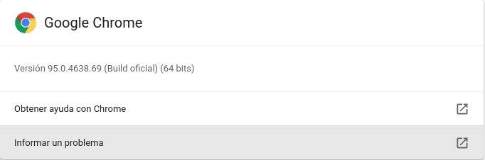

# Osu-Recovery
Programa para la descarga o recuperación de todas la canciones jugadas de OSU de un perfil determinado.

Este programa usa Python3 con el paquete Selenium.

## Requerimientos
Este programa puede ser ejecutado tanto en Linux como en Windows.
Se requiere tener:
- Python 3
- Paquete Selenium
- Google Chrome
- Chrome Driver

Para tener la instalación de estos requerimientos se puede realizar de la siguiente forma.
### **Linux**
1. #### **Python 3**
Actualmente linux viene instalado con Python 3, puede verificar la versión que está usando con el siguiente comando.
~~~
$ python3 --version
~~~
Si no cuenta con Python 3 puede revisar la documentación para la instalación en : <https://docs.python-guide.org/starting/install3/linux/>

2. #### **Selenium**
Para obtener el paquete Selenium en Linux se usará la herramienta PIP que viene instalada con Python en las ultimas versiones.

En caso no cuente con PIP puede revisar el siguiente enlace para la instalación con Python 3 : <https://tecnonucleous.com/2018/01/28/como-instalar-pip-para-python-en-windows-mac-y-linux/>

La instalación de Selenium se puede realizar con el siguiente comando.
~~~
$ pip install selenium
~~~
3. #### **Chrome Driver**
Luego de tener instalado el programa Google Chrome, tienes que verificar la versión de tu navegador, esto se hace dando click en ⁝ > Ayuda > Acerca de Google Chrome.

Viendo esto luego descargar de esta página, tu versión de driver: 
https://chromedriver.chromium.org/downloads

Buscas tu versión y descargas el chromedriver_linux64.zip y lo descomprimes, lo copias y lo pegas en la carpeta actual con el nombre chromedriver

### **Windows**
1. #### **Python 3**
Para la instalación de Python 3 en Windows, se puede realizar descargandolo desde su web oficial : <https://www.python.org/downloads/>

Al iniciar la instalación deberá marcar la casilla "Add Python3 to PATH"

3. #### **Chrome Driver**
Luego de tener instalado el programa Google Chrome, tienes que verificar la versión de tu navegador, esto se hace dando click en ⁝ > Ayuda > Acerca de Google Chrome.

Viendo esto luego descargar de esta página, tu versión de driver: 
https://chromedriver.chromium.org/downloads

Buscas tu versión y descargas el chromedriver_win32.zip y lo descomprimes, lo copias y lo pegas en la carpeta actual con el nombre chromedriver.exe

## Instrucciones de uso
Para el uso del programa de debe abrir una terminal y dirigirse a la carpeta "Osu-Recovery".

El programa requiere que el inicio de sesión para la descarga adecuada de mapas.

Se tiene que descargar en orden la parte 0 para los de 1-99, parte 1 para 100-199, parte 2 para 200-299, etc

Cada parte tiene que tener un tiempo de separación de 10 minutos mínimo o se tendrá un problema gracias al límite de descargas en menos de 10 min, **SI DESCARGAS SIN RESPETAR ESTE TIEMPO ENTONCES SE DESCARGARÁN CON ERROR MUCHOS MAPAS Y TE BLOQUEARÁN UNOS MINUTOS CON ERROR 429**

**En Caso de usar Linux, cambia la línea del código en python, cambias "ruta_driver = './chromedriver.exe" a "ruta_driver = './chromedriver"**

~~~
usage: extraccion_mapas.py [-h] [-u USER] [-p PASSWORD]
options arguments:
-h, --help                              show this help message and exit.
-u USER, --user USER                    Name of user.
-p PASSWORD, --password PASSWORD        Password of account.
-wv, --withvideo                        This option downloads maps with video only in case the map has.
-ou, OTHERUSER, --otheruser OTHERUSER   This option allows you to download maps from other users.
-pt, PART, --part PART                  This indicate the part of your list maps gonna be download, 0=[0-99], 1=[100-199], ..."
~~~

### Ejemplo de uso:
---
#### Linux y Windows:

~~~
python3 osu-recovery.py -u "Fulanito" -p "Fulanito123" -pt 0
python3 osur-recovery.py -u "Fulanito" -p "Fulanito123" -wv -ou "https://osu.ppy.sh/users/7562902" -pt 1
~~~